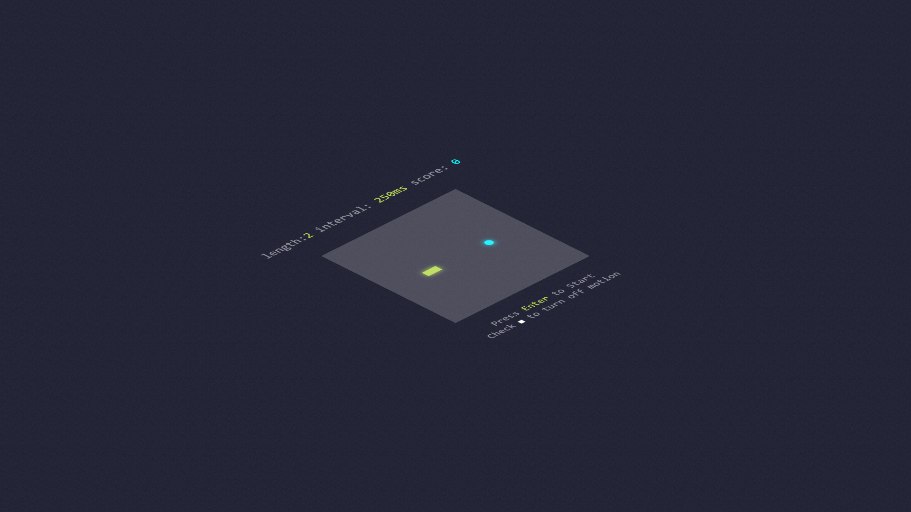

# Snake

Vanilla JS interpretation of the [Snake](https://en.wikipedia.org/wiki/Snake_(video_game_genre)) game. The snake's goal is to eat the mice as they appear; mind you, the snake's movement speed increases each time it consumes a mouse, and the game is over if the snake's head runs into any part of its own body. The project's aims were 1. a straightforward implementation, and 2. apply aesthetics that are unusual for the genre while adding quality to the gameplay.

## Screenshot

## License

See the [LICENSE](./LICENSE.md) file for license rights and limitations.